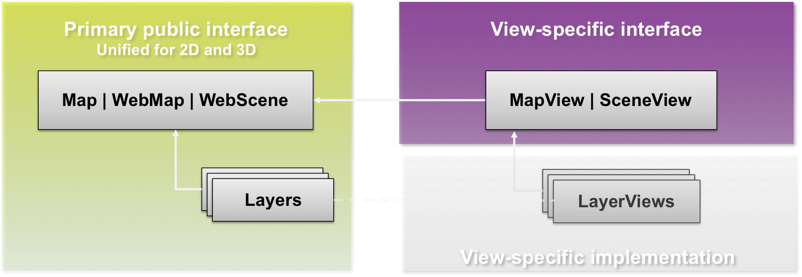

<!-- .slide: data-background="template/start.png" -->

#ArcGIS API for Javascript
#What's new for 4.0
Yann Cabon

[](https://github.com/ycabon/presentations)


---

# 4.0

- Overview
- Architecture: Map and Views
- Architecture: core components
- Features
- Future work

---

# 4.0 Overview

---

## In a nutshell

- Simplified API
- `WebMap` and `WebScene`, first class citizens
- Brings 3D capabilities
- APIs and Widgets redesign
- Lot of common patterns shared with Quartz Runtime SDKs

---

## In a nutshell

- New architecture
- AMD only
- IE9+ for 2D, IE11+ for 3D

- Classes properly cased: `esri/Map`, `esri/Graphic`, `esri/layers/Layer`
- New folder structure.

---

## Releases

- Already in production in the WebScene Viewer
- beta1, released in mid-july
- beta2, November 19th
- Planned: beta3 in december
- Planned: final in 2016 - devsummit

---

# Architecture
## Map and Views

---

## Why a new architecture?
 - One of the starting point of 4.0: bring 3D
 - currently in [3.x](http://developers.arcgis.com/javascript/samples/map_simple/):
  - Map, many DOM nodes
  - Each Layer, 1 DOM Node
 - rendering 3D with WebGL which is completely different

---

## New architecture
 - Separate the business logic from the drawing logic.


---

```js
  var map = new Map({
    basemap: 'topo',
    layers: [
      new ArcGISDynamicLayer(...)
    ]
  });

  var mapView = new MapView({
    map: map,
    container: 'mapDiv'
  });

  var sceneView = new SceneView({
    map: map,
    container: 'sceneDiv'
  });
```
[side by side views](demos/accessor/side-by-side.html)

---

## 2D/3D

- For the rest, one API
- [DEMO](demos/visualization/epic-citadel.html)

---

## 2D

- new "engine" in the work.
- faster, more future proof
  - abstraction to draw tiles and dynamic images to ease custom layers/layerviews
  - abstraction to draw in DOM or Canvas, possibly WebGL
- display graphics while zooming.
- rotation
- continous zoom
- [vector map tiles](http://blogs.esri.com/esri/arcgis/2015/07/20/vector-tiles-preview/), [basemaps](http://basemapsbeta.arcgis.com/preview/app/index.html)

---

## 3D

 - WebGL engine to display the globe.
 - [z/m support](http://maps.esri.com/rc/sat/index.html) in the API, tasks, layers...
 - support for simple symbols
 - new 3D Symbols

---


# Architecture
## new core components

- `esri/core/Accessor`
- `esri/core/Promise`
- `esri/core/Loadable`
- `esri/core/Collection`

---

## `esri/core/Accessor`
 - Mixin similar to `dojo/Stateful`
 - Consistent pattern:
  - getting and setting properties value
  - watching properties change
 - Single object constructor
 - Computed properties
 - Autocast

---

## Properties watching

 - Direct benefits:
   - remove inconsistancies between constructor, getter, setter functions, events
   - one convention everywhere. _"just need to know what properties for a class"_
   - Single object constructor, no more 3+ constructors
   - Leaner SDK: we doc only the properties, the rest is convention

 - Changes:
   - no more **_property_**-change events, use `watch()`
   - in 3.x, listen for [`extent-change`](https://developers.arcgis.com/javascript/jsapi/map-amd.html#event-extent-change) event.
   - in 4.0 `extent` watchers will be call very often
   - new events and properties for animation. 

---

## Accessor - Properties watching

```javascript

var map = new Map(...);
var view = new MapView({ map: map });

// watch for viewpoint updates
view.watch('viewpoint', function(newValue, oldValue, property, target) {
  console.log(newValue, oldValue, property, target);
})

// chain watching
map.watch('basemap.title', function(value) {
  console.log(value);
});
map.basemap = 'topo';
```

---

## Accessor - Properties watching

- Frameworks integration
  - properties are framework agnostic
  - better/easier integration

- Examples
  - [dbind](demos/integration/dbind.html)
  - [React](http://jsbin.com/togemadodo/1/edit?js,output)
  - [camera recorder](http://output.jsbin.com/donujo)

---

## Accessor - unified single object constructor

- Constructors of any subclass of `Accessor` accepts a single object.
- forget the order of arguments
- we do support old signatures for convenience like `new Point(x, y, z)`
- /!\ This can look like JSON, but it isn't. Old JSON constructor signatures are removed instead `MyClass.fromJSON()`

---

## Accessor - unified single object constructor

```js
require([
  'esri/Map',
  'esri/Basemap',
  'esri/core/Collection',
  'esri/layers/ArcGISTiledLayer'
],
function(
  Map,
  Basemap,
  Collection,
  ArcGISTiledLayer
) {
  var map = new Map({
    basemap: new Basemap({
      baseLayers: new Collection([
        new ArcGISTiledLayer(url)
      ])
    })
  });
});
```

---

## Accessor - autocast

- Automatically create an instance of the expected type.
- What you assign to the property is passed to the constructor of the class.
- For example, `MapView.center` is of type `Point` so you can do

```js
view.center = [0, 0];
view.center = [0, 0, 0];
view.center = { longitude: 0, latitude: 0 };
view.center = { x: 0, y: 0, spatialReference: 102100 };
...
```

- All properties might not support this at the moment.  

---

## Accessor - autocast


```js
require([
  'esri/Map',
  'esri/layers/ArcGISTiledLayer'
],
function(
  Map,
  ArcGISTiledLayer
) {
  var map = new Map({
    basemap: {
      baseLayers: [
        new ArcGISTiledLayer(url)
      ]
    },

    initialExtent: {
      xmin: -180, xmax: 180,
      ymin: -80, ymax: -80,
      spatialReference: { wkid: 4326 }
    }
  });
});
```

---

## Accessor - autocast

```js
  // 3.x
  new SimpleMarkerSymbol(SimpleMarkerSymbol.STYLE_SQUARE, 10,
    new SimpleLineSymbol(SimpleLineSymbol.STYLE_SOLID,
    new Color([255,0,0]), 4),
    new Color([255,255,255,0.25]));

  // 4.0
  new SimpleMarkerSymbol({
    style: 'square',
    color: 'red',
    size: 10,

    outline: {
      color: 'rgba(255, 255, 255, 0.5)'
      width: 4
    }
  });
```

---

## Accessor - autocast

class example:

```js
var Map = Accessor.createSubclass({
    // or declare([Accessor], { ... })

  classMetadata: {
    properties: {
      basemap: {
        type: Basemap
      },
      initialExtent: {
        type: Extent
      },
      layers: {
        type: Collection
      }
    }
  }

});
```

---

## Accessor - computed properties

```js
var Person = Accessor.createSubclass({
  classMetadata: {
    properties: {
      fullName: {
        readOnly: true,
        dependsOn: ['lastName', 'firstName']
      }
    }
  },

  _fullNameGetter: function() {
    return this.firstName + ' ' + this.lastName;
  }

});

var john = new Person({
  firstName: 'John',
  lastName: 'Doe'
});
john.fullName; // 'John Doe'
```

---

## Promises

- 4.0 is a promises-based architecture!
- [Getting Started with Dojo](http://dojotoolkit.org/documentation/tutorials/1.10/deferreds/index.html)
- all async fonctions and methods are returning to `Promise`. no more [events](https://developers.arcgis.com/javascript/jsapi/querytask-amd.html#events)

```js
  someAsyncFunction()
    .then(
      function(resolvedVal){
        //This is called when the promise resolves
        console.log(resolvedVal);  //logs the value the promise resolves to
      }
    )
    .otherwise(
      function(error){
        //This function is called when the promise is rejected
        console.error(error);  //logs the error message
      }
    );
```

---

## Promises

 - Classes may be Promise
  - because they might have to load resources
  - because they might be asychronously initialized

 `Map`, `Layer`, `View`

```js
var map = new Map({...})

view = new SceneView({
  map: map,
  //...
});

view.then(function() {
  // the view is ready to go
});
```

---

## Loadable - 4.0beta2

- brings better control, and scheduling of loading resources.
- extension of `esri/core/Promise`
- in 3.x, instanciating a layer loads it. in 4.0, it's an explicit call
- the views automatically loads the map and its layers
- use cases:
  - `WebMap` / `WebScene` / `Basemap` need to load:
    - the portal item
    - the layer modules
    - the layer portal items
  - `MapView` / `SceneView` need to load:
    - the map
    - the layers
  - BasemapGallery need to load
   - basemaps from the portal, not the layers

---

In a single page application, get a feature from a FeatureLayer from a WebMap without displaying it, ASAP!

```js
  var webmap = new WebMap({
    portalItem: {
      id: 'affa021c51944b5694132b2d61fe1057'
    }
  });

  webmap.load()
    .then(function() {
      return webmap.getLayer('myFeatureLayerId').load();
    })
    .then(function(featureLayer) {
      return featureLayer.queryFeatures({
        where: 'OBJECTID = 1'
      });
    })
    .then(function(result) {
      dsiplayDetails(result.features[0]);
    })
    .otherwise(function(error) {
      console.error(error);
    });
```

---

## Collection

 - More or less like an Array
 - `add` / `remove` / `forEach` / `map` / `find` / `findIndex`...
 - emit `'change'` events when something is added/removed/moved
 - used for layers, used for layers in Basemap, used for graphics...

---

# Features

---

## SDK

- New SDK built from scratch
 - [beta1](https://developers.arcgis.com/javascript/beta/)
 - [beta2](http://localhost/~yann6817/sdk/)
- Simpler, focused samples
- User experience
 - Find the relevant information
- More code snippets

---

## Layers

- `map.layers`, a collection of the operational layers
  - mix of image AND graphics
- Shorter names: `ArcGISTiledLayer`, `ArcGISDynamicLayer`
- new ones:
  - `ArcGISElevationLayer`
  - `SceneLayer`
  - `GroupLayer`

---

## GroupLayer

  - New layer: GroupLayer
  - group layers together
  - structure your data visualization     
  - visibility mode: `exclusive`, `independent`, `inherit`
  - listMode: `hide-children`, `hidden`
  - [DEMO](demos/grouplayer/index.html)  

---

## GroupLayer

```javascript
map = new Map({
  basemap: 'dark-gray',
  layers: [
    new GroupLayer({
      title: 'USA Tiled Services',
      visibilityMode: 'exclusive',
      //listMode: 'hide-children',
      layers: [
        new ArcGISTiledLayer({
          url: '//server.arcgisonline.com/ArcGIS/rest/services/Demographics/USA_Median_Household_Income/MapServer',
          title: 'Median Household Income',
          visible: false
        }),
        new ArcGISTiledLayer({
          "url": '//services.arcgisonline.com/ArcGIS/rest/services/Demographics/USA_Tapestry/MapServer',
          "title": "Tapestry Segmentation",
          visible: true
        })
      ]
    })
  ]
});
``` 

---

## VectorTileLayer

- vector data stored in tiles
  - binary format
- styling is down clientside
- consumes new VectorTile service
- new client-side layer

```js
new VectorTileLayer({
  url: ...
});
```

- vector basemaps available through known names
- [DEMO](demos/vectortiles/vectortile.html)

---

## Basemap

- full fledge class `esri/Basemap`
- basemap's layers are _not_ part of the `map.layers`, but from `map.basemap`
- contains 3 Collections: baseLayers, referenceLayers, elevationLayers
- can be set with
  - [string for esri's basemap](demos/basemap/2d.html)
  - or custom [Basemap instance](demos/basemap/2d-custom.html)
  - in 2D and [3D](demos/basemap/3d.html)

---

## Basemap

- `basemap` as a string, creation of the appropriated Basemap instance

```js
var map = new Map({
  basemap: 'topo'
});

map.basemap = 'streets';
```

- `basemap` as an instance of `Basemap`

```js
var map = new Map({/*...*/});

var toner = new Basemap({
  baseLayers: [
    new WebTiledLayer({
      urlTemplate: '...'
    })
  ]
})

map.basemap = toner;
```

---

## Padding

- easier fullscreen view application.
- defines inner margin to make space for UI.
- [2D](demos/padding/2d.html)
- [2D](demos/popup/popup-custom-actions.html)
- [3D](demos/padding/3d.html)

---

## Animation

- generic function `animateTo(target, options):Promise`

```js
querytask.execute(query).then(function(result) {
  view.animateTo(result.features, {
    duration: 3000
  });
});
```

- customize [easing, duration, chaining](demos/animation/random.html)
- DIY using [other libs](demos/animation/tweenjs.html)
- `esri/core/Viewpoint`: common way to share between 2D/3D

---

## UI/UX - Resizing

- DOM isn't our friend
- automatically measure and position the view
- [resize by center, or not](demos/resizing/manual-resize.html)
- better integration with responsive design pages
- and [frameworks](demos/resizing/responsive-bootstrap.html)


---

## UI/UX - CSS

- all existing CSSs are revisited for the views and widget.
- decreased class complexity
  - easily customize the tinyest aspects of each component.
- consistent `kebab` case of CSS class names.
- all classes are prefixed by `esri-` to avoid conflicts with CSS frameworks.

---

## UI/UX - ViewUI

View exposes an API to manipulate the UI elements on top of the layers. Still WIP

```js
view = new MapView({
  ui: {
    components: ["zoom", "compass", "attribution"]
  }
});
```

```js
// adding UI elements on specific positions
var ui = view.ui;
ui.add(search, "top-right");
ui.add(home, {
  position: "top-left",
  index: 0
});
``` 

[DEMO](demos/ui/responsive.html)

---

## UI/UX - Widgets

- widgets designed as MVVM
  - one ViewModel, many Views
  - separates the logic from the UI/UX implementation
  - easier to create new views using other frameworks
- ported to 4.0beta: `Search`, `Zoom`, `Attribution`, `Popup`
- new ones: `Compass`

---

## UI/UX - Popup

- The Popup in 4 went through a complete redesign.

- The UX was improved in the following areas:
 - It can be docked, through a user action or as an property
 - It is [responsive](demos/popup/popup.html) and works well in small spaces
 - Allows for easy navigation of multiple features.
 - in beta3, includes new large scale view of images and charts to better communicate key information.

- On the developer side:
 - Easily style the popup to match your app
 - [Custom actions](demos/popup/popup-custom-actions.html) can be configured to expose extra capabilities

---

## Portal, WebMap, WebScene

- are central classes of the API.
- replace the 3.x `esri/arcgis/utils`
- easy to access, modify, and persist back to portal.

---

```js
var portal = new Portal({
  authMode: 'immediate', // anonymous | auto | immediate
  canSearchPublic: true,
  url: '//jsapi.maps.arcgis.com'
});

portal.load()
  .then(function() {
    return portal.queryItems({
      query: 'Brest'
    });
  })
  .then(function() {
    displayResults(...)
  });
```

---

## WebMap and WebScene

 - Map holds
  - basemap
  - operational layers
  - initial state

 - WebMap, WebScene hold
  - portal item
  - presentations
  - environment options

 - Scene can be global or local

---

```js
var scene = new WebScene({
  portalItem: new PortalItem({
    id: 'affa021c51944b5694132b2d61fe1057'
  })
});

var view = new SceneView({
  map: scene,
  container: 'viewDiv'
});

```

[loading a webscene](http://localhost/~yann6817/sdk/sample-code/sandbox/sandbox.html?sample=webscene-basic)  
[scene local](demos/webscene/local.html)  
[scene slides](demos/webscene/slides.html)

---

## Conclusion

- One API
- 3D, and better 2D
- New concepts
  - to observe properties with Accessor
  - to handle asynchronous operations with Promise
- Simplified and consistent API

---

<!-- .slide: data-background="template/questions.png" -->

# Questions
  
@yanncabon  
ycabon@esri.com  

---

<!-- .slide: data-background="template/end.png" -->

