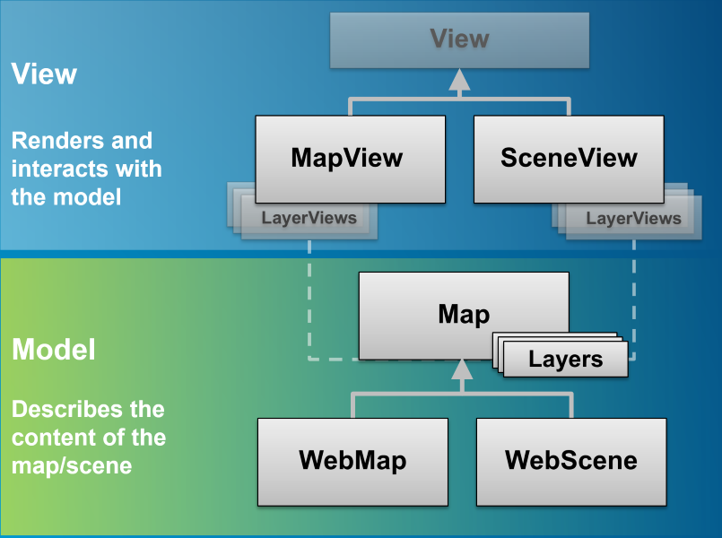
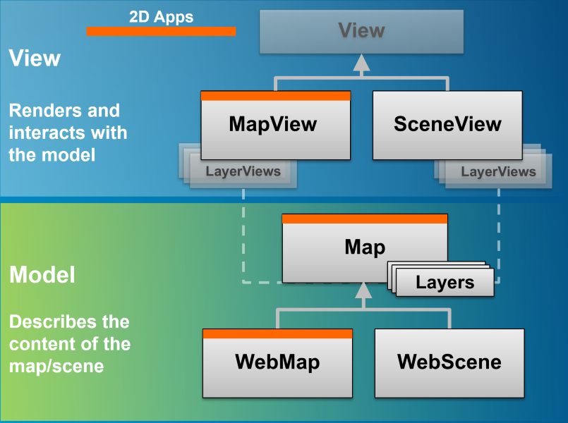

<!-- .slide: class="title" -->

## ArcGIS API for JavaScript
## Discover 4.0 - the Next Generation
Yann Cabon & René Rubalcava

[](https://github.com/ycabon/presentations/tree/gh-pages/2016-devsummit-discover-4.0-the-next-generation)

---

<!-- .slide: class="agenda" -->

## Agenda

- Overview
- Coding patterns
- Map and View Architecture
- UI and Widgets
- Features

---

<!-- .slide: class="section" -->

# Overview

---

## Overview

- project started late 2013
- introduction of 3D and WebScene
- new [WebScene Viewer](//www.arcgis.com/home/webscene/viewer.html) built with new API
- new [SDK](//developers.arcgis.com/javascript/) rebuilt from scratch

---

## Overview

- New Portal API
- Better integration of `WebMap`
 - place the intelligence of the [arcgis.com map viewer](//www.arcgis.com/home/webmap/viewer.html) in the API
 - addition of missing components like `GroupLayer`
 - switching spatial reference
- APIs and Widgets redesign

---

## Overview

- new development patterns
- new architecture
- 3D
- AMD only
- Modern browsers only: `IE11+`

---

<!-- .slide: class="section" -->

# Coding patterns

---

## Coding patterns

New core classes to get the job done
- `esri/core/Accessor`
- `esri/core/Promise`
- `esri/core/Loadable`
- `esri/core/Collection`

---

## `esri/core/Accessor`

- base class of most of the API
- consistent pattern:
 - getting and setting properties value
 - watching properties change
- unifed object constructor
- computed properties
- autocast

---

## Properties watching

- Direct benefits:
 - remove inconsistancies between constructor, getter, setter functions, events
 - one convention everywhere. _"just need to know what properties for a class"_
 - Single object constructor, no more 3+ constructors
 - Leaner SDK: we doc only the properties, the rest is convention

- Changes:
 - no more **_property_**-change events, use `watch()`
 - in 3.x, listen for [`extent-change`](https://developers.arcgis.com/javascript/jsapi/map-amd.html#event-extent-change) event.
 - in 4.0 `extent` watchers will be call very often

---

## Accessor - Properties watching

```javascript
var map = new Map(...);
var view = new MapView({ map: map });

// watch for view scale updates
view.watch('scale', function(newValue, oldValue, property, target) {
  console.log(newValue, oldValue, property, target);
})

// chain watching
map.watch('basemap.title', function(value) {
  console.log(value);
});
map.basemap = 'topo';
```

- [demo](http://output.jsbin.com/tasetu)

---

## Accessor - Unified Object Constructor

```js
require([
  'esri/Map',
  'esri/Basemap',
  'esri/core/Collection',
  'esri/layers/ArcGISTiledLayer'
],
function(
  Map,
  Basemap,
  Collection,
  ArcGISTiledLayer
) {
  var map = new Map({
    basemap: new Basemap({
      baseLayers: new Collection([
        new ArcGISTiledLayer(url)
      ])
    })
  });
});
```

---

## Accessor - Autocast

```js
require([
  'esri/Map',
  'esri/layers/ArcGISTiledLayer',
  'esri/views/MapView'
],
function(
  Map,
  ArcGISTiledLayer,
  MapView
) {
  var map = new Map({
    basemap: {
      baseLayers: [
        new ArcGISTiledLayer(url)
      ]
    }
  });

  var view = new MapView({
    map: map,
    container: 'viewDiv',

    extent: {
      xmin: -180, xmax: 180,
      ymin: -80, ymax: -80,
      spatialReference: 4326
    }
  });
});
```

---

## Accessor - Autocast

```js
  // 3.x
  new SimpleMarkerSymbol(SimpleMarkerSymbol.STYLE_SQUARE, 10,
    new SimpleLineSymbol(SimpleLineSymbol.STYLE_SOLID,
    new Color([255,0,0]), 4),
    new Color([255,255,255,0.25]));

  // 4.0
  new SimpleMarkerSymbol({
    style: 'square',
    color: 'red',
    size: 10,

    outline: {
      color: 'rgba(255, 255, 255, 0.5)'
      width: 4
    }
  });
```

---

## Accessor - Autocast

class example:

```js
var Map = Accessor.createSubclass({
    // or declare([Accessor], { ... })

  classMetadata: {
    properties: {
      basemap: {
        type: Basemap
      },
      initialExtent: {
        type: Extent
      },
      layers: {
        type: Collection
      }
    }
  }

});
```

---

## Accessor - Computed properties

```js
var Person = Accessor.createSubclass({

  classMetadata: {
    properties: {
      fullName: {
        readOnly: true,
        dependsOn: ['lastname', 'firstname']
      }
    }
  },

  _fullNameGetter: function() {
    return this.firstname + ' ' + this.lastname;
  }

});

var JohnDoe = new Person({
  firstname: 'John',
  lastname: 'Doe'
});
```

---

## Promises

- All asynchronous methods return a promise, no more [events](https://developers.arcgis.com/javascript/jsapi/querytask-amd.html#events)
- The basic pattern looks like this:

```js
  someAsyncFunction().then(
    function(resolvedVal){
      //This is called when the promise resolves
      console.log(resolvedVal);  //logs the value the promise resolves to
    },
    function(error){
      //This function is called when the promise is rejected
      console.error(error);  //logs the error message
    }
  );
```

---

## Promises

- Classes may be Promise
 - Load resources
 - Asychronously initialized `Layer`, `WebMap`, `WebScene`, `View`
 - `view.then()` replaces `map.on('load', ...)`

```js
var map = new Map({...})

view = new SceneView({
  map: map,
  //...
});

view.then(function() {
  // the view is ready to go
});
```

---

## Loadables

- brings better control, and scheduling of loading resources.
- extension of `esri/core/Promise`
- in 3.x, instanciating a layer loads it. in 4.0, it's an explicit call
- the views automatically loads the map and its layers

---

## Loadables

- `WebMap` / `WebScene` need to load:
 - the portal item
 - the layer module
 - the layer's item
- `MapView` / `SceneView` need to load:
 - the map
 - the layers

---

In a single page application, get a feature from a FeatureLayer from a WebMap without displaying it, ASAP!

```js
  var webmap = new WebMap({
    portalItem: {
      id: 'affa021c51944b5694132b2d61fe1057'
    }
  });

  webmap.load()
    .then(function() {
      return webmap.getLayer('myFeatureLayerId').load();
    })
    .then(function(featureLayer) {
      return featureLayer.queryFeatures({
        where: 'OBJECTID = 1'
      });
    })
    .then(function(result) {
      displayDetails(result.features[0]);
    })
    .otherwise(function(error) {
      console.error(error);
    });
```

---

## Collection

 - More or less like an Array
 - in house methods `add` / `remove` ...
 - array methods `forEach` / `map` ...
 - newer array methods `find` / `findIndex`...
 - emit `"change"` events when something is added/removed/moved
 - used for layers, used for layers in Basemap, used for graphics...
 - autocasting support

```js
var PointCollection = Collection.ofType(Point);
var collection = new PointCollection();

collection.add([-100,40]);

var point = collection.getItemAt(0);
//point.x = -100; point.y = 40
```

---

<!-- .slide: class="section" -->

# Map and View architecture

---


## Map and View architecture

- One of the starting point of 4.0: bring 3D
- completely different rendering system
- isolate the 2D rendering from the 3D one

---

## Map and View architecture


---

## Map and View architecture



---

## Map and View architecture



---

## MapView and SceneView - multiple views

```js
  var map = new Map({
    basemap: 'topo',
    layers: [
      new ArcGISDynamicLayer(...)
    ]
  });

  var mapView = new MapView({
    map: map,
    container: 'mapDiv'
  });

  var sceneView = new SceneView({
    map: map,
    container: 'sceneDiv'
  });
```
[side by side views](demos/architecture/side-by-side.html)  
[plenary demo](demos/architecture/multiple-views.html)

---

## LayerViews

- `LayerViews` renders the layers on the view.
- [LayerView](/javascript/4/api-reference/esri-views-layers-LayerView.html) has limited API so far.
- give info about layer rendering
 - 3.x: `Layer.suspended` now `LayerView.suspended` 
- will give access to data displayed on the screen
 - Features
 - Elevation data
- ability to override properties from the layer
 - visibility
 - renderer
 - ...

---

## LayerViews

- access a layerview with [`View.whenLayerView()`](/javascript/4/api-reference/esri-views-View.html#whenLayerView) 

```js
  var map = new Map({
    basemap: 'topo'
  });
  var mapView = new MapView({
    map: map,
    container: 'mapDiv'
  });

  var layer = new FeatureLayer(...)
  map.add(layer);

  view.whenLayerView(layer)
    .then(function(layerView) {
      layerView.visible = false
    });
```
- or [`View.allLayerViews`](/javascript/4/api-reference/esri-views-View.html#allLayerViews) 

---

<!-- .slide: class="section" -->

# Widgets and UI

---

## Widgets

- [Out of the box widgets at 4.0](demos/widgets/all-widgets.html):
 - Zoom
 - Attribution
 - Compass
 - Home
 - Locate
 - Search
 - Legend
 - Popup
   - [dockable](/javascript/4/sample-code/popup-docking/live/index.html)
   - [custom actions](demos/widgets/popup/custom-actions.html)
- New design and user experience

---

## Widgets

- Extensibility through:
 - [CSS](demos/css/index.html), [matching vectortiles](demos/css-vectortiles/index.html)
 - SASS
 - View Model

---

## Widgets - View Model

- New architecture
- Logic of the widget separated from the representation
- View implementations made in dijit/Accessor
- Views' source code available in the [SDK](/javascript/4/api-reference/widgets/zoom/index.html)
- View's can be rewritten in [any framework](demos/widgets/framework/index.html)
- ViewModels can be combined to create [Frankenwidgets](demos/widgets/frankenwidget/index.html)

---

## UI

- Managed overlay to place widgets over the view.
- Well known widgets can be directly added or removed from the view
- [Provides responsive information](demos/ui/responsive.html), [plenary demo](demos/ui/popup-responsive/index.html)

```js
var view = new MapView({

  ui: {

    padding: {
      top: 16,
      left: 16,
      right: 16,
      bottom: 16
    },

    components: ["zoom", "compass", "attribution"]

  }

});
```

---

## UI

- API to add widgets or any DOM element to the 4 corners of the view

```js
var view = new MapView({
  //...
});

var legend = new Legend({
  //...
});

view.ui.add(legend, "top-left");
```

- [plenary demo](demos/widgets/all-widgets.html)

---

<!-- .slide: class="section" -->

# Features

---

## Features

- `Basemap`
- `GroupLayer`
- Animation
- Environment
- Portal API
- `WebMap` and `WebScene`

---

## Basemap

- full fledge class `esri/Basemap`
- basemap's layers are _not_ part of the `map.layers`, but from `map.basemap`
- contains 2 Collections: `baseLayers`, `referenceLayers`
- can be set with
  - [string for esri's basemap](demos/basemap/2d.html)
  - or custom [Basemap instance](demos/basemap/custom-arctic.html)
  - in 2D and [3D](demos/basemap/custom-arctic-3d.html)

---

## Basemap

- `basemap` as a string, creation of the appropriated Basemap instance

```js
var map = new Map({
  basemap: 'topo'
});

map.basemap = 'streets';
```

- `basemap` as an instance of `Basemap`

```js
var map = new Map({/*...*/});

var toner = new Basemap({
  baseLayers: [
    new WebTiledLayer({
      urlTemplate: '...'
    })
  ]
})

map.basemap = toner;
```

---

## GroupLayer

  - New layer: GroupLayer
  - group layers together
  - structure your data visualization     
  - visibility modes: `exclusive`, `independent`
  - listMode: `hide-children`, `hidden`
  - [demo](demos/grouplayer/index.html)  

---

## GroupLayer

```javascript
map = new Map({
  basemap: 'dark-gray',
  layers: [
    new GroupLayer({
      title: 'USA Tiled Services',
      visibilityMode: 'exclusive',
      //listMode: 'hide-children',
      layers: [
        new ArcGISTiledLayer({
          url: '//server.arcgisonline.com/ArcGIS/rest/services/Demographics/USA_Median_Household_Income/MapServer',
          title: 'Median Household Income',
          visible: false
        }),
        new ArcGISTiledLayer({
          "url": '//services.arcgisonline.com/ArcGIS/rest/services/Demographics/USA_Tapestry/MapServer',
          "title": "Tapestry Segmentation",
          visible: true
        })
      ]
    })
  ]
});
``` 

---

## Also

- `map.layers`, a collection of the operational layers
  - mix of image AND graphics
- Shorter names: `ArcGISTiledLayer`, `ArcGISDynamicLayer`
- new ones:
  - `ArcGISElevationLayer`
  - `SceneLayer`

---

## Animation

- both in 2D and 3D, navigating around can be complex
- generic function `goTo(target, options):Promise`
- accepts a wide variety of target parameters

```js
querytask.execute(query)
  .then(function(result) {

    // Animate to the features
    return view.goTo(result.features, {
      duration: 3000
    });

  })
  .then(function() {
    // animation is done
  });
```

[demo](demos/animation/index.html)

---

## Environment

- defines light characteristics
- stars!

```js
sceneView.environment = {
  atmosphere: {
    quality: 'high'
  },

  starsEnabled: true,

  lighting: {
    directShadowsEnabled: true,
    ambientOcclusionEnabled: true,

    // The time and date for which
    // the sun position and light direction is computed.
    date: new Date("Mon Mar 07 2016")
  }
};
```

[demo](demos/environment/environment.html), [plenary demo](demos/environment/environment-brest.html)

---

## Portal API

- [redesigned API](/javascript/4/api-reference/esri-portal-Portal.html)
- access portal information: basemaps, featuring content
- query items, users, groups
- loading items like layers, webmap and webscene
- creating, deleting and updating items

---

## Portal API

```js
var portal = new Portal();

// Setting authMode to immediate signs the user in once loaded
portal.authMode = 'immediate';

// Once loaded, user is signed in
portal.load()
  .then(function() {
    // Create query parameters for the portal search
    var queryParams = new PortalQueryParams({
      query: 'owner:' + portal.user.username,
      sortField: 'numViews',
      sortOrder: 'desc',
      num: 20
    });

    // Query the items based on the queryParams created from portal above
    portal.queryItems(queryParams).then(createGallery);
  });
```

[demo](/javascript/4/sample-code/identity-oauth-basic/live/index.html)

---

## Portal API

```js
var promise = Layer.fromPortalItem({
  portalItem: {
    id: '8444e275037549c1acab02d2626daaee',
    portal: {
      url: 'https://myorg.maps.argis.com'
    }
  }
})
.then(function(layer) {
  // Adds the layer to the map once it loads
  map.add(layer);
})
.otherwise(function(error) {
  //handle the error
});
```

[demo](/javascript/4/sample-code/layers-portal/live/index.html)

---

## WebMap and WebScene

- `WebMap` is the document of a 2D Map
- `WebScene` is the document of a 3D Map
- extend common `Map` class
- first class citizens of the API
- can be consumed by apps accross the platform

---

## WebMap and WebScene

- full `WebScene` support
- `WebMap` support for key layers
 - degrade non yet supported layers as `UnsupportedLayer`
 - full support planned for end 2016
- writing under-development

---

## WebMap and WebScene

- similarities
 - `basemap`
 - operational data: `layers`
- specialities
 - environment, ground, SceneLayer
 - different type of presentations
 - more...

---

## WebMap and WebScene

```js
var webmap = new WebMap({
  portalItem: {
    id: 'e691172598f04ea8881cd2a4adaa45ba'
  }
});
```
[demo](demos/platform/webmap.html)

```js
var webscene = new WebScene({
  portalItem: {
    id: '19dcff93eeb64f208d09d328656dd492'
  }
});
```
[demo](demos/platform/webscene.html)

---

## WebScene specificities - `slides`

- created with the webscene viewer
- store layers visibility, camera, environment

```js
// slides from webscene's presentation
var slides = scene.presentation.slides;

// create a clickable thumbnails
slides.forEach(function(slide) {
  var thumb = new Slide({
    slide: slide
  });
  thumb.on('click', function() {
    // apply the slide on the view
    slide.applyTo(view);
  });
  slidesDiv.appendChild(thumb.domNode);
});

```

---

## WebScene specificities - `viewingMode`

- visualize `global` or `local` scenes
- `local` scenes are best for projected data and underground display

```js
var view = new SceneView({
  
  viewingMode: 'local',

  clippingArea: {
    xmin: ...
    ymin: ...
    xmin: ...
    ymin: ...
    spatialReference: ...
  },

  map: new WebScene(...)
});

```

- [demo](demos/platform/webscene-local.html)

---

<!-- .slide: class="questions centered" -->

# Questions
  
@yanncabon  
ycabon@esri.com  
  
@odoenet  
rrubalcava@esri.com  

---


<!-- .slide: class="end" -->
