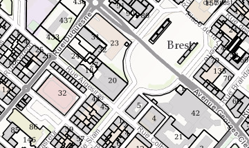
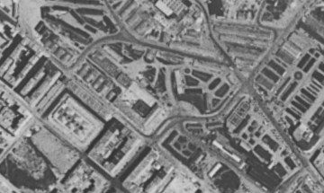
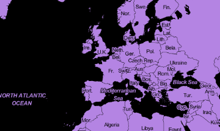
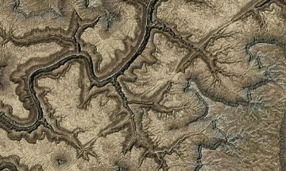
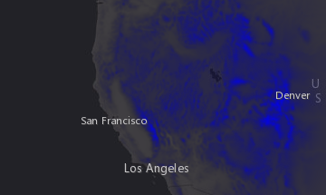
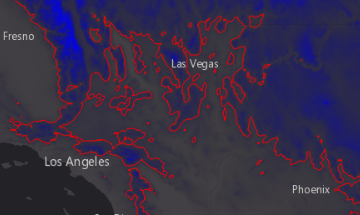
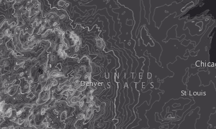

# Building Custom Layers

Presentation given at Esri DevSummit 2017 to give an overview, at that time, of the extensibility of the ArcGIS API for JavaScript 4.  
Each examples are based onto a development build API 4.4. They might break but will be updated for the 4.4 release.

## Demos

### Dynamic Layer

Example of layer that consumes a WMS service by extending `BaseDynamicLayer` class and its `getImageUrl()` method.
  

### Tile Layer

Example of layer that consumes a WMS service by extending `BaseTileLayer` class and its `getTileUrl()` method.

Example of layer that fetches tile images and colorize them using HTML canvas.

### Layer loading

Another use of HTML canvas to blend tiles fetched from 2 services. Demonstrate how to specify resources needed for the layer to be `loaded`.

### LERC and Worker

Example to decode and elevation tiles, in LERC format using HTML Canvas.

Example to generate one contour line from elevation tiles, implementing the algorithm described here http://blog.bruce-hill.com/meandering-triangles/

Example to generate **many more** contour lines from elevation tiles, using web workers

## Licence

MIT