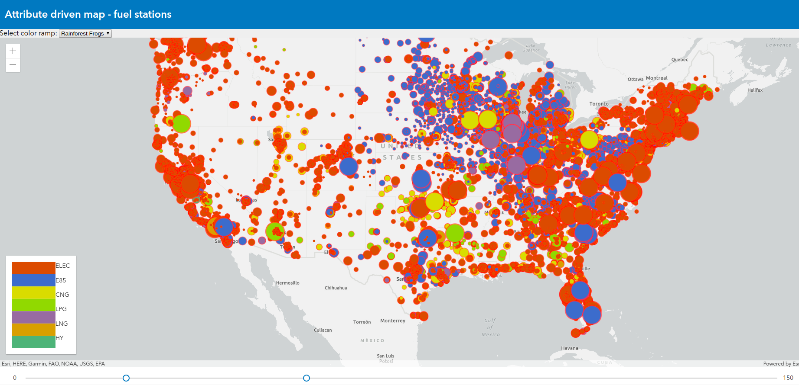

# ArcGIS API for JavaScript: A Look Under The Hood

Presentation recorded for DevSummit 2020 by Yann Cabon and Yaron Fine. [Watch it on YouTube](https://www.youtube.com/watch?v=rZwtb2qglT8)

## Slides

WIP

## Demos

- [32bit precision issue](https://ycabon.github.io/presentations/2020-devsummit/ArcGIS-API-for-JavaScript-Under-The-Hood/src/demo1/)
- [Tiling](https://ycabon.github.io/presentations/2020-devsummit/ArcGIS-API-for-JavaScript-Under-The-Hood/src/demo2/)
- [Feature tiles queries](https://ycabon.github.io/presentations/2020-devsummit/ArcGIS-API-for-JavaScript-Under-The-Hood/src/tile-drilling/)
- [Quantization compare](https://ycabon.github.io/presentations/2020-devsummit/ArcGIS-API-for-JavaScript-Under-The-Hood/src/quantization-compare/)
- [Server quantization](https://ycabon.github.io/presentations/2020-devsummit/ArcGIS-API-for-JavaScript-Under-The-Hood/src/demo3/)
- Off the main thread processing
  - [Simple Worker](https://ycabon.github.io/presentations/2020-devsummit/ArcGIS-API-for-JavaScript-Under-The-Hood/src/workers/1-simple.html)
  - [Promised API](https://ycabon.github.io/presentations/2020-devsummit/ArcGIS-API-for-JavaScript-Under-The-Hood/src/workers/2-promise.html)
  - [Using an AMD loader in Worker](https://ycabon.github.io/presentations/2020-devsummit/ArcGIS-API-for-JavaScript-Under-The-Hood/src/workers/3-amd-loader.html)
  - [API worker framework](https://ycabon.github.io/presentations/2020-devsummit/ArcGIS-API-for-JavaScript-Under-The-Hood/src/workers/4-api-worker-framework.html)
  - [Putting it all together](https://ycabon.github.io/presentations/2020-devsummit/ArcGIS-API-for-JavaScript-Under-The-Hood/src/demo4/)
- [Data-driven rendering - fuel stations](https://ycabon.github.io/presentations/2020-devsummit/ArcGIS-API-for-JavaScript-Under-The-Hood/src/demo5/)
- [Fast updates](https://ycabon.github.io/presentations/2020-devsummit/ArcGIS-API-for-JavaScript-Under-The-Hood/src/demo6/)

- 

