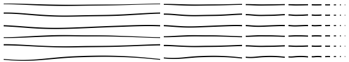

# Sketch edges

The JS API supports rendering of "sketch" edges that emulate a hand-drawn look. This section provides implementation
details for rendering this type of edge.

## Stroke texture atlas

We use a pre-generated stroke texture atlas for the sketch edges. The atlas consists of a fixed number of variants that have
been generated using several octaces of perlin noise. The individual strokes are generated s.t. they are seamless
(by sampling 1d noise circularly from a 2d noise function) so that we can generate more variance given a limited number
of strokes (see next section).

The strokes are encoded in the texture atlas as an offset from the center of the line (negative or positive) so that
we can render high quality edges at different resolutions while varying certain aspects (like the width of the line)
without re-rasterizing strokes. In addition to an offset, we also encode a similar atlas of "pressure" for each stroke.
The pressure is a multiplier (0 to 1) that emulates pen pressure along the stroke, changing the width of the stroke
to make it appear less regular and more hand-drawn. Note that due to WebGL 1 limitations, we encode the offset and
pressure values as normalized (0 to 1) floating point values encoded in a fixed point RGBA (unsigned byte) texture.
Values are decoded and de-normalized in the shader.

Strokes are stored at 256px resolution and are manually mip-mapped to generate 128px, 64px etc. versions of each
stroke. The correct resolution is picked in the shader depending on the length of the edge on screen. The following is
an example of what the various strokes and their mipmap variants look like when rasterized.



See [strokes.ts](./strokes.ts) for the table containing offset and pressure values for the highest mipmap level for each
stroke variant.

## Variance

We aimed to obtain a reasonable amount of variance to minimimze repeating patterns in the scene when drawing sketch
edges. Variance is obtained by picking for each detected edge:

1. A random stroke variant (one of currently six variants).
2. A random horizontal offset within the stroke. We can do this because the strokes are seamless and so we can use
   repeat texture wrap to start a sketch edge at any point on the stroke.

To obtain stability in the visualization between reloads of the scene, we use a pseudo random generator with a seed
based on the hash of the world vertex coordinates of the edge. Although this does not guarantee full stability
(e.g. variants will differ for different LODs of the same geometry), it works pretty well in practice and at least
guarantees that scenes will look the same (when reloaded) from the same view points.

## Extensions

Edges can optionally have "extensions", which means that they will extend beyond the vertices that make up the edge. The
"sketch" style in the Scene Viewer automatically configures extensions (which are configured separately in the symbology
model). Note that at the symbology level we only expose a single `extensionLength` parameter (`0` meaning no extension).
When rendering `solid` edges, this extension is simply the fixed pixel size of additional extension on the edge in each
direction. For `sketch` however we apply a "hand-drawn" concept to the extension length, similar to how we apply a
deformation to the edge itself.

For extensions on sketch edges we found that we get better visualizations if we allow both under and over extension. At
the same time, we found that visualizations tend to be better when we under-extend more than we over-extend (over
extension tends to look messy and noisy if used to much). We currently use the following to calculate the sketch
extension length (for each edge):

```ts
// Factor that determines how much we want to skew the random distribution to "under extension"
const skewUnderFactor = 0.7;

// Random value between 0 and 1
const rnd = random();

const under = -(1.0 - Math.min(rnd / skewUnderFactor, 1));
const over = Math.max(0, rnd - skewUnderFactor) / (1 - skewUnderFactor);

// Finally, the actual sketch extension length (can be positive for over extension, or negative for
// under extension)
const sketchExtensionLength = signedPow(under + over, 1.2) * symbolExtensionLength;

// abs(v) to the power n, keeping the sign of v
function signedPow(v: number, n: number): number {
  const sign = v < 0 ? -1 : 1;
  return Math.pow(Math.abs(v), n) * sign;
}
```

## Rendering details

Most of the work for rendering the edges is done in the shader. The process is roughly as follows:

1. Extrude the edge in the vertex shader, based on the maximum amplitude of the stroke, the edge vertex positions and
   potential subpixel AA (if enabled)
1. Pick a mipmap level based on the edge pixel length and sample the offset and pressure (we pack these in the same
   texture for convenience)
1. Compute the fragment shading based on the line thickness, sampled offset and sampled pressure

There are a couple of additional things that we do that are worth noting:

1. We discard very short edges to reduce edge density and noise (for sketch edges, we discard any edges < 3px length).
1. We anti-alias edges in the shader for improved subpixel rendering. All edges are rendered as individual segments
   without generating any joins between the edges. To reduce artifacts, we generate round caps for each edge and use MAX
   blending (edges are rendered in a separate offscreen pass and then blitted back) to avoid ordering and blending
   artifacts. If MAX blending is not enabled (IE11) then we do not do sub-pixel AA in the shader. Using the MAX blending
   scheme does suffer from artifacts with overlapping edges of different colors, but this rarely is a problem in practice.
1. The shader can be configured to render one specific style (solid, sketch) or can be configured as an uber shader in
   which case the same program can handle both solid and sketch edges.
